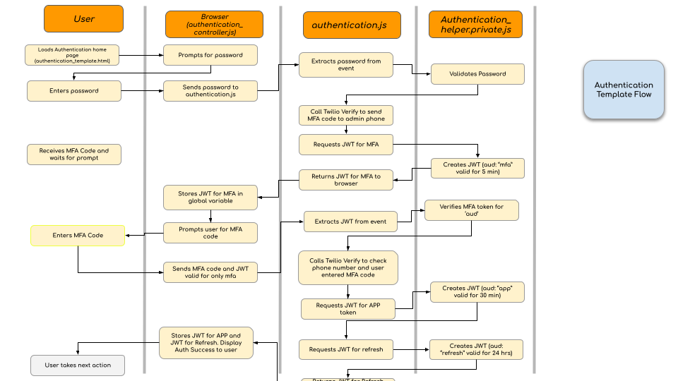

# Authentication Template: Technical Guide


This document is intended to serve as a technical guide for developers who intend to use 
the authentication template in their application. This template takes care allowing customers
to authenticate using a password and a two-factor authentication code sent to their phone.

## How to Use this Template

### Copy Files

* Copy `assets/authentication-controller.js` to `assets` folder in your project
* Copy `assets/authentication.css` to `assets` folder in your project
* Copy `functions/authentication.js` and `functions/authentication-helper.private.js` to `functions` folder
* Copy `.env.localhost` file into your project's main folder.

### Make Changes to your Code

* `<your-project>/.env` 
  * Add the contents of `authentication-template/.env` 
  * Be careful when overwriting any existing variables
* `<your-project>/assets/index.html`
  * Include `authentication-controller.js` using `<script>` tag at the top.
  * Include HTML code from `assets/index.html`. This HTML code 
  displays and manages Password and MFA code fields.
* `<your-project>/package.json`
  * Include `jsonwebtoken` in `dependencies` section as shown in the template's package.json.

### Set Environment Variables

* ADMINISTRATOR_PHONE_NUMBER - this is the phone number used to send MFA code
* VERIFY_SERVICE_NAME - this is the name of the Twilio Verify service used to send the MFA code. We recommend using customer name for service name


### Protect your Public Functions

In your Twilio function, call `isValidAppToken` method in `authentication-helper.js` as in example code below.

```
exports.handler = function(context, event, callback) {
const { path } = Runtime.getFunctions()["authentication-helper"];
const { isValidAppToken } = require(path);

/* Following code checks that a valid token was sent with the API call */
if (!isValidAppToken(event.token, context)) {
const response = new Twilio.Response();
response.appendHeader('Content-Type', 'application/json');
response.setStatusCode(401);
response.setBody({message: 'Invalid or expired token'});
return callback(null, response);
}

/* Your application logic goes here */
const output = 'Hello world, you have a valid token!';

/* Send your application response */
const response = new Twilio.Response();
response.appendHeader('Content-Type', 'application/json');
response.setStatusCode(200);
response.setBody({message:output });
callback(null, response);
};
```

### Call Protected Functions from Client

In your client-side controller code, include the value of `accessToken` 
variable as `token` property in the request body.

If API calls from your controller return 401 Unauthorized, it implies that
the access token has expired. Include logic to
enable the Password form so that the login process can start again.

See example code below:

```
async function sampleTwilioCall(e){
    e.preventDefault();
    fetch('/hello-world', {
        method: 'POST',
        headers: {
            Accept: 'application/json',
            'Content-Type': 'application/json'
        },
        body: JSON.stringify({token:accessToken})
    }).then((response) => {
        if (!response.ok && response.status === 401) {
            // The accesst token has expired
            // Inform the user to login again
        }
        return response.json();
    }).then((r) => {
        $('#sample-response').text(r.message)
    })
}
```

### Token Refresh

The template shows how the access token can be refreshed automatically
behind the scenes based on a variable called `userActive` This variable is
`true` always by default. You can add logic that sets this to `false` when your 
user has been inactive for a certain period of time. This will prevent the 
access token from being refreshed by this logic. 


## Run Authentication Template Locally

Use the following instructions to run authentication-template directly from this repo without 
incorporating in your project.

### Set Local Environment Variables

Copy .env to `env.localhost` and set all required parameters 

```
ACCOUNT_SID=AC################################
AUTH_TOKEN=################################

APPLICATION_PASSWORD=yourpassword
DISABLE_AUTH_FOR_LOCALHOST=false

TWILIO_ACCOUNT_SID=AC################################
TWILIO_AUTH_TOKEN=##################################
ACCOUNT_SID=AC################################
AUTH_TOKEN=##################################
TWILIO_PHONE_NUMBER=+1##########
ADMINISTRATOR_PHONE=+1##########
VERIFY_SERVICE_NAME=customername
```

### Run Locally with the following Commands

First deploy the template using: `$twilio serverless:deploy`

Next, run it locally using: `$twilio serverless:start --env=.env.localhost`

### Disabling Authentication when Running Locally

You can add the following variable with a `true`/`false` value to your local environment file (such as
`env.localhost`) to help with faster testing bypassing the MFA.

* DISABLE_LOCAL_AUTHENTICATION - this variable is used for local testing. When it is set to true, the user will be logged in when
  running locally even if they provide incorrect password. Also no MFA will be required. This is useful for convenient development and testing.


## Authentication Flow:



